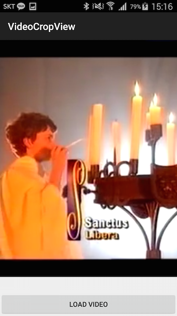

# Android-VideoCropView
ViewView for crop video

this version provide aspect ratio only 3:4.
next version will provide several aspect ratio

## Example
append your layout xml
```xml
<com.mabi87.videocropviewsample.VideoCropView
        android:id="@+id/cropVideoView"
        android:layout_width="match_parent"
        android:layout_height="wrap_content" />
```

request video
```java
Intent lIntent = new Intent(Intent.ACTION_PICK);
lIntent.setType("video/*");
lIntent.addFlags(Intent.FLAG_ACTIVITY_CLEAR_TOP);
startActivityForResult(lIntent, 1000);
```

and set image Uri
```java
mVideoCropView.setVideoURI(selectedVideoUri);
```



swipe video and change view matrix


## Licence
Copyright 2015 Mabi

Licensed under the Apache License, Version 2.0 (the "License");<br/>
you may not use this work except in compliance with the License.<br/>
You may obtain a copy of the License at

http://www.apache.org/licenses/LICENSE-2.0

Unless required by applicable law or agreed to in writing, software<br/>
distributed under the License is distributed on an "AS IS" BASIS,<br/>
WITHOUT WARRANTIES OR CONDITIONS OF ANY KIND, either express or implied.<br/>
See the License for the specific language governing permissions and<br/>
limitations under the License.
